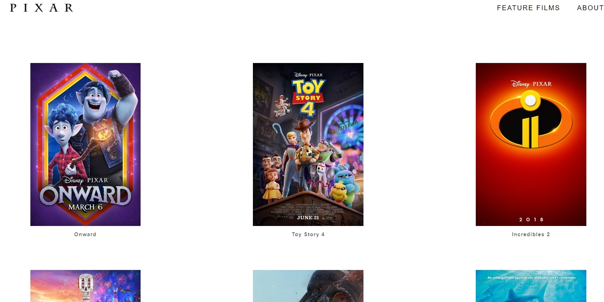

# Pixar

Replication of [Pixar site](https://www.pixar.com/). Films are stored as a JSON database online.

Developed with React, Typescript, Redux, JS, HTML, CSS, [Express using JSON-server library to connect our JSON database and app together](https://github.com/typicode/json-server).

Cloudinary is used to store film images.

# Why I Built It and What I've Learned:

-   To understand the benefits and drawbacks of Typescript in a development setting of React and Redux.

## Typescript For React:

Pros:

-   Allows code to be "descriptive". Making the process of understanding and maintaining the code easier. Higher confidence in code not breaking.
-   Allows us to catch errors during development/compile-time rather than run-time, which facilitates debugging.
-   Catching basic type errors. Such as assigning a variable that is meant String values to have a value of an int; passing in a value that is an int to a function argument that is supposed to have a String.
-   Catching complex types errors. Such as an undefined prop and a prop that has the wrong type in a component. Caught by defining **interfaces** that will tell the component what kind of props it should have.

Cons:

-   Certain npm packages do not come with a type definition file(@types/package_name). This would lead to issues such as TS not compiling. An approach to the problem would be to create our own type definition file (desc.d.ts is created in this project to bypass the compiler error).
-   TS could break the code when packages are updated/type definition files are updated; it would require us to change the types in our code.

## Typescript For Express:

-   TS is not used in Express (server.js) in this project because server.js uses JSON-Server library to operate. I figured it would be more knowledgable to learn more about TS without using JSON-Server library.

## External resources:

-   Prettier to format code and EsLint for linting.
-   Redux dev tool google chrome extension to check the values of the states.
-   JSON-server for a local database.

## What It Looks Like





# Getting Started

These instructions will get you a copy of the project up and running on your local machine for development and testing purposes.

1. Clone the project. Use `npm install` to install all the dependencies. Run the project with `npm start` for development or `npm run build` for production.

2. OPTIONAL: If you want to make changes locally, on the terminal, go to the `backend` directory. Type `npm start` to start the local JSON-server server/api which will connect the front-end to the database. Type `npm run start:json` to turn on the local JSON database. Then change the axiosConfig route file to http://localhost:3000.

# Prerequisites

What things you need to install the software

```
- Any package manager (npm, yarn)
```

# Versioning

None
